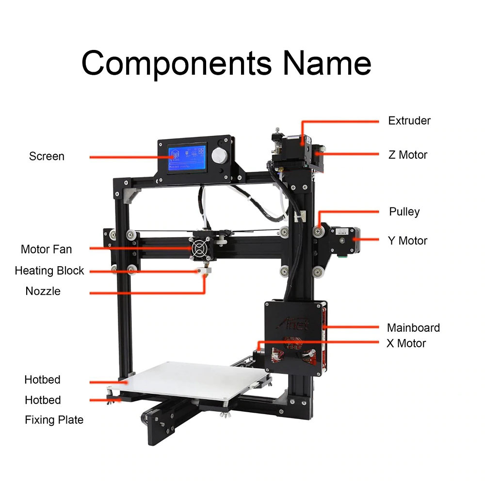
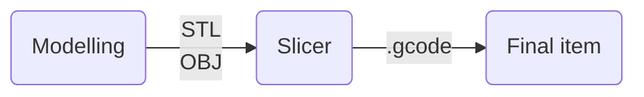
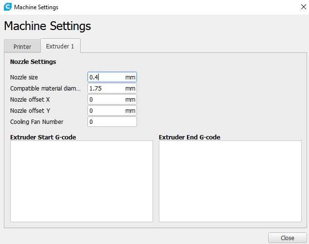
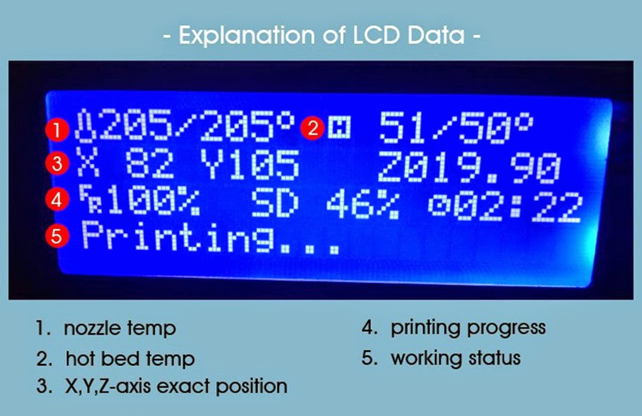

# 3D Printing

[TOC]

## 3D Printer parts

- extruder : estrusore
- spool : rotolo
- nozzle : ugello
- print ed : piatto

## Phaes

| Modelling                                   | Slicer                                     |
| ------------------------------------------- | ------------------------------------------ |
| Autodesk Fusion 360                         | Cura                                       |
| Autodesk 123                                | [Simplify 3D](https://www.simplify3d.com/) |
| Onshape                                     | [Slicer](https://www.slicer.org/)          |
| Blender                                     | Idea Maker                                 |
| Zibrush ($)                                 | [Kisslicer](http://www.kisslicer.com/)     |
| Sculptrist                                  | [CraftWare]                                |
| Sketch up                                   |                                            |
|                                             |                                            |
| **Online database**                         | Pronterface                                |
| [Thingiverse](https://www.thingiverse.com/) | Repetier - Host                            |

Notes:

- STL : Mesh polygonal. The item is made of many triangles 

## Materials

| Name  | Full name                                                    |     Usage      | Temperature | Speed  |   Cost   |                      Notes                      |
| :---: | ------------------------------------------------------------ | :------------: | :---------: | :----: | :------: | :---------------------------------------------: |
|  PLA  | *Poly(lactic acid*) or polylactic acid or polylactide (*PLA*) |    Generic     |    Lower    |        | Cheapest |                 Easiest to use                  |
|  PET  |                                                              |                |  Same PLA   | Slower |          |                                                 |
|  ABS  |                                                              |                |             |        |          | derived from petrol Toxic More robust |
| PETG  |                                                              |                |             |        |          |                                                 |
| Nylon |                                                              | Mechanic piece |    High     |        |          |                                                 |

> https://www.prusa3d.com/material-guides/

## Links

- [RepRap](https://reprap.org/wiki/RepRap)
- [stampa3d-forum](https://www.stampa3d-forum.it/)

## Make model

### Autocad Fusion 360

#### Export to stl

1. `File` --> `3D Print` 
2. Select the item
3. Uncheck `Send to 3D Print Utility`

## Make gcode

### Cura

1. Open stl file with Cura or any other slicer program.
2. Select your printer (if not present, create a custom profile and set manufactures values) [see here](#profiles)
3. Adjust your item if required
4. Set all printing settings
5. Click on `Prepare` - Waiting for the slicing
6. Click on `Save to File` in order to save the gcode file

#### Profiles

##### Prusa i3

* **Machine Settings - Extruder**
  
* **Machine Settings - Printer**
  

## Printing Steps

1. Calibrate the print bad

  1. `Prepare` --> `Auto Home` : reset axis

  2. `Prepare` --> `Disable steppers` : disable steppers in order to move them during the calibration

  3. Move the nozzle and the print bad to the 4 corners and the centre. For each position (5 in total), take a A4 paper a move it along the surface: make sure the extruder does not obstruct the movement and the friction is always the same

    > In case of adjusting, use the screws in the 4 corners

  :bulb: https://help3d.it/come-calibrare-il-piano-di-stampa/

2. Insert the filament:

  press on the spring and insert the filament into the nuzzle. Release the spring

3. On the printer controller: `Prepare`--> `Preheat PLA` --> 0.2 mm (Profile)

4. Remove the residual material from the nozzle:

  1. `Prepare` --> `Move axis` --> Select `Move 1mm` (or `Move 0.1 mm`) --> `Extruder` --> Rotate in order to get the material getting out

     > The Extruder must be heat in order to making this point working

5. Clean the surface making sure is not warm. Use alcohol 

6. Select the the object to print:

  1. `Print from SD` --> Select the gcode file to print

  > During the printing, you can change the extruder temperature

## Display info

<!--stackedit_data:
eyJoaXN0b3J5IjpbMTU2NTU4MDIzM119
-->
