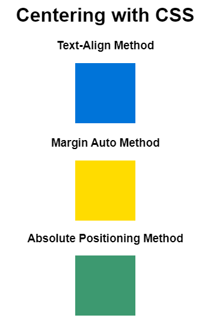

# HTML


<!-- toc -->

- [HTML](#html)
  - [Elements](#elements)
    - [Checkbox with text clickable and not selectable](#checkbox-with-text-clickable-and-not-selectable)
  - [Loader](#loader)
  - [Disable browser caching with meta HTML tags](#disable-browser-caching-with-meta-html-tags)
  - [Align elements on the same line](#align-elements-on-the-same-line)
    - [Method1](#method1)
    - [Method2](#method2)
  - [Center things with style](#center-things-with-style)
    - [Text-Align Method](#text-align-method)
    - [Margin Auto Method](#margin-auto-method)
    - [Absolute Positioning Method](#absolute-positioning-method)
  - [Navigation Top bar](#navigation-top-bar)

<!-- tocstop -->

## Elements

### Checkbox with text clickable and not selectable
```html
<label class="noselect" for="discovery_update" style="display: inline-block"><input type="checkbox" name="discovery_update" id="discovery_update">Update</label>
```


## Loader
[How To Make a Loader](https://www.w3schools.com/howto/howto_css_loader.asp)

**Loader html element**
**Html code**
```html
<h5 id="loader_label" class="center" style="display: none; height: 40px">Processing...</h5>
<div id="loader" class="loader center" style="display: none"></div>
```

Loader trigger: usually it's triggered once the form has being submitted: `onsubmit` event
```html
<form action="/generate" onsubmit="return show_loading()" method="post">
```

**Javascript code**
```js
function show_loading(){
  document.getElementById('loader').style.display='';
  document.getElementById('loader_label').style.display='';

  return true;  // set false for debug, in order to block the submit
}
```


**CSS code**
```css
.loader {
  border: 16px solid #f3f3f3;     /* Light grey */
  border-top: 16px solid #3498db; /* Blue */
  border-radius: 50%;
  width: 120px;
  height: 120px;
  animation: spin 2s linear infinite;
}

@keyframes spin {
  0% { transform: rotate(0deg); }
  100% { transform: rotate(360deg); }
}
```

Alternative styles:
```css
.loader {
  border-top: 16px solid blue;
  border-bottom: 16px solid blue;
}
```


```css
.loader {
  border-top: 16px solid blue;
  border-right: 16px solid green;
  border-bottom: 16px solid red;
}
```

```css
.loader {
  border-top: 16px solid blue;
  border-right: 16px solid green;
  border-bottom: 16px solid red;
  border-left: 16px solid pink;
}
```


## Disable browser caching with meta HTML tags
* https://stackoverflow.com/questions/42855187/how-to-add-version-number-to-html-file-not-only-to-css-and-js-files
* http://cristian.sulea.net/blog/disable-browser-caching-with-meta-html-tags/

```python
resp.headers["Cache-Control"] = "no-cache, no-store, must-revalidate"
resp.headers["Pragma"] = "no-cache"
resp.headers["Expires"] = "0"
```

## Align elements on the same line

### Method1
Use `display:inline-block` with `text-align:center` on the parent

### Method2
CSS
```css
.alignleft {
  float: left;
}
.alignright {
  float: right;
}
```

HTML
```html
<div id="textbox">
<p class="alignleft">Text on the left.</p>
<p class="alignright">Text on the right.</p>
</div>
```


## Center things with style
[How to center things with style in CSS](https://www.freecodecamp.org/news/how-to-center-things-with-style-in-css-dc87b7542689/)



**Html code**
```html
<h1>Centering with CSS</h1>

<h3>Text-Align Method</h3>
<div class="blue-square-container">
  <div class="blue-square"></div>
</div>

<h3>Margin Auto Method</h3>
<div class="yellow-square"></div>

<h3>Absolute Positioning Method</h3>
<div class="green-square"></div>
```

**CSS code**
```css
h1,
h3 {
  text-align: center;
}

.blue-square-container {
  text-align: center;
}

.blue-square {
  background-color: #0074D9;
  width: 100px;
  height: 100px;
  display: inline-block;
}

.yellow-square {
  background-color: #FFDC00;
  width: 100px;
  height: 100px;
  margin: 0 auto;
}

.green-square {
  background-color: #3D9970;
  width: 100px;
  height: 100px;
  position: absolute;
  left: 50%;
  margin-left: -50px;
}
```

### Text-Align Method

**CSS code**
```css
h3 {
  text-align: center;
}

.blue-square-container {
  text-align: center;
}

.blue-square {
  background-color: #0074D9;
  width: 100px;
  height: 100px;
  display: inline-block;
}
```

**Html code**
```html
<h3>Text-Align Method</h3>
<div class="blue-square-container">
  <div class="blue-square"></div>
</div>
```

### Margin Auto Method

**CSS code**
```css
h3 {
  text-align: center;
}

.yellow-square {
  background-color: #FFDC00;
  width: 100px;
  height: 100px;
  margin: 0 auto;
}
```

**Html code**
```html
<h3>Margin Auto Method</h3>
<div class="yellow-square"></div>
```


### Absolute Positioning Method

**CSS code**
```css
h3 {
  text-align: center;
}

.green-square {
  background-color: #3D9970;
  width: 100px;
  height: 100px;
  position: absolute;
  left: 50%;
  margin-left: -50px;
}
```

**Html code**
```html
<h3>Absolute Positioning Method</h3>
<div class="green-square"></div>
```


## Navigation Top bar
* https://www.w3schools.com/css/css_navbar.asp


CSS
```css
/* The navigation bar */
.navbar {
overflow: hidden;
background-color: #333;
position: fixed; /* Set the navbar to fixed position */
top: 0; /* Position the navbar at the top of the page */
width: 100%; /* Full width */
}

/* Links inside the navbar */
.navbar a {
float: left;
display: block;
color: #f2f2f2;
text-align: center;
padding: 14px 16px;
text-decoration: none;
}

/* Change background on mouse-over */
.navbar a:hover {
background: #ddd;
color: black;
cursor: pointer;
}

/* Main content */
.main {
margin-top: 60px; /* Add a top margin to avoid content overlay */
}
```

Html
```html
<div class="navbar">
<a href="#home">Home</a>
<a href="#news">News</a>
<a href="#contact">Contact</a>
</div>

<div class="main">
<p>Some text some text some text some text..</p>
</div>
```